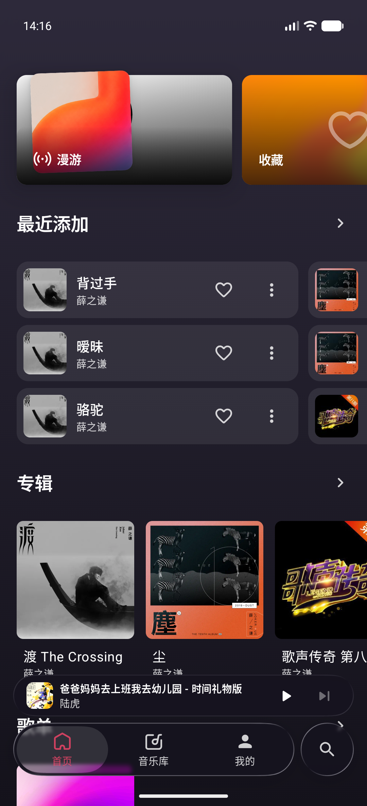
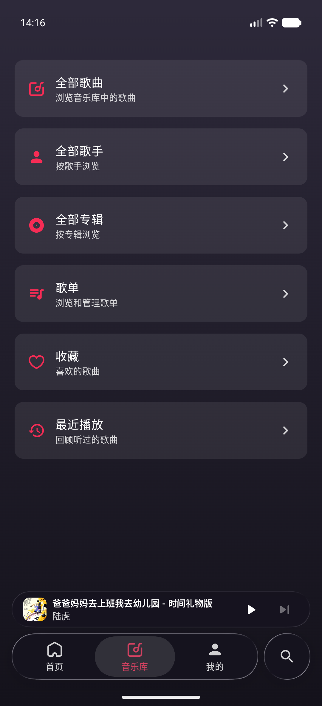
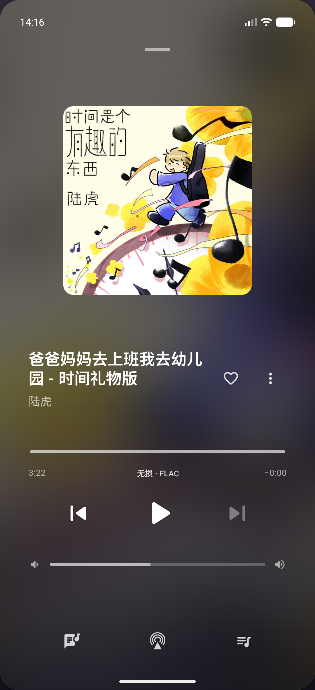

# FnMusic

[简体中文](README.md) · **English**

Bring your fnOS music library to Android, with AirPlay output and online lyric search added to the experience. Connect to your own NAS and listen your way.

FnMusic is an unofficial third-party client for Android 8.0 and later. It is still in development, so features and interface details may change.

## Preview

  
  
  

Home · Library · Player

## What FnMusic adds

### AirPlay output

Choose an AirPlay receiver on the same local network from the player and send music from your NAS to another audio device. Pause, skip, seek, and adjust the receiver's volume from your phone, or switch back to local playback. Playback has been verified with a macOS receiver; compatibility with other receivers is still unverified. See the [AirPlay guide](docs/airplay.md).

### Online lyric search

FnMusic can match lyrics automatically from NetEase Cloud Music, QQ Music, Kugou, and AMLL TTML DB, preferring word-timed lyrics and falling back to your fnOS library when needed. You can also search and preview results yourself, save a choice for one track, and adjust its timing. Settings let you choose source priority and manage the lyric cache. Searches send track titles and artist names to the selected provider, never your NAS credentials. See [Lyrics](docs/features.md#lyrics).

## Everyday listening

- **Connect to your library:** Sign in with your fnOS account using FN Connect or a custom NAS address.
- **Find something to play:** Explore recently added music, albums, and playlists from Home; browse by track, artist, or album; or search directly.
- **Make it yours:** Favorite tracks, revisit recently played music, and create or edit playlists.
- **Keep listening:** Background playback, notification and lock-screen media controls, and local audio output.
- **Set it up your way:** Light and dark themes, streaming quality and cache preferences, and layouts adapted to phones and larger screens.

## Why FnMusic?

Music stored on your own NAS deserves an easy way to reach AirPlay devices and better lyrics for the songs you love. FnMusic is being built around those listening moments, alongside the everyday tools for browsing, favorites, and playlists.

## Get started

For now, [build the APK from source](docs/development.md#build-from-source). Then connect to your own NAS with an existing fnOS Music account. Android 8.0 or later is required.

FnMusic follows the observed behavior of the current fnOS Music web client. **It is not an official fnOS app and does not use an official public API.** Compatibility may vary between fnOS versions.

## Documentation

- [Features and settings](docs/features.md)
- [Build, modules, and verification](docs/development.md)
- [Protocol notes](api.md) (Chinese)
- [Testing guide](docs/testing.md)

## License and notice

FnMusic-authored code and documentation are licensed under the [Apache License 2.0](LICENSE). It permits use, modification, and redistribution, including commercial use, subject to conditions such as retaining license and copyright notices and marking changes. It also includes a patent grant. See the [license scope](LICENSE-SCOPE.md) for what is covered.

fnOS trademarks, web-derived assets, fonts, music artwork, and screenshots containing that artwork **are not covered by this grant**. Third-party components retain their own licenses. This project is not affiliated with fnOS; see the [development guide](docs/development.md#assets-and-trademarks) for asset sources.
